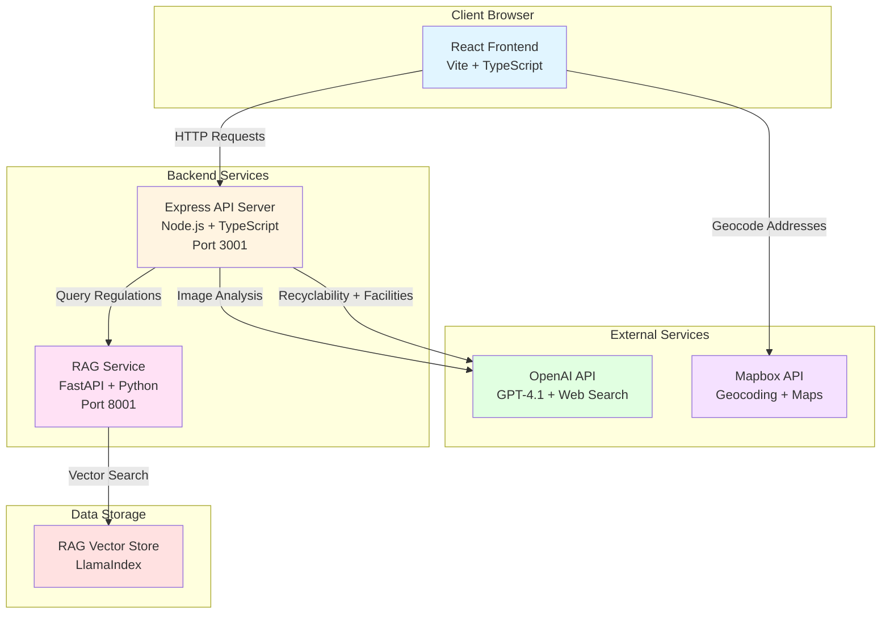
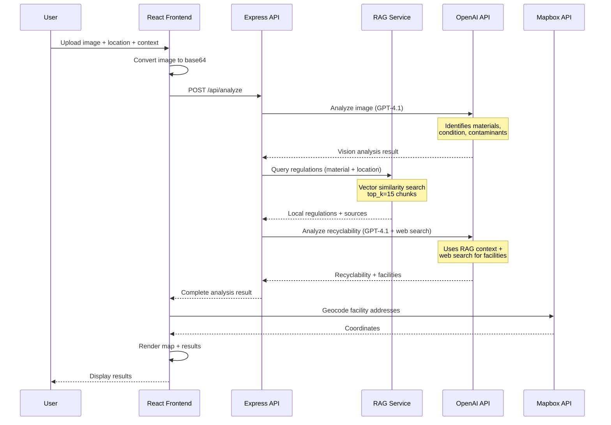

# RecycLens

An AI-powered recycling assistant that helps users identify recyclable items and find nearby recycling facilities using computer vision, RAG (Retrieval-Augmented Generation), and web search.

## Features

- **Image Analysis**: Upload a photo of an item to identify its materials using OpenAI's vision capabilities
- **Recyclability Assessment**: Get instant feedback on whether an item can be recycled with confidence scores
- **RAG-Enhanced Regulations**: Uses Retrieval-Augmented Generation (RAG) to provide accurate, location-specific recycling regulations from official sources
- **Local Facilities**: Find nearby recycling and disposal facilities using web search
- **Interactive Map**: View facilities on an interactive Mapbox map with markers and geocoding
- **Clear Instructions**: Receive step-by-step guidance for proper disposal
- **Real-time Progress**: Visual feedback during analysis stages

## Tech Stack

- **Frontend**: React 18 + Vite + TypeScript + Tailwind CSS
- **Backend**: Node.js + Express + TypeScript
- **RAG Service**: Python + FastAPI + LlamaIndex for querying local recycling regulations
- **AI Services**: 
  - OpenAI Responses API (GPT-4.1) with web search for recyclability assessment
  - OpenAI Responses API (GPT-4.1) for image analysis
- **Maps**: Mapbox GL JS + Mapbox Geocoding API
- **Deployment**: Railway (with Nixpacks builder)

## Architecture Overview

RecycLens follows a microservices architecture with clear separation between frontend, backend API, and RAG service:



## Project Structure

The project is organized within an `app/` directory structure:

```mermaid
graph TD
    APP[app/]
    
    APP --> SRC[src/]
    APP --> SERVER[server/]
    APP --> RAG_SERVICE[rag_service/]
    APP --> RAG_DATA[rag/]
    APP --> CONFIG[Config Files]
    
    SRC --> COMPONENTS[components/]
    SRC --> HOOKS[hooks/]
    SRC --> UTILS[utils/]
    SRC --> TYPES[types/]
    SRC --> APP_TSX[App.tsx]
    SRC --> MAIN[main.tsx]
    
    COMPONENTS --> IMG_UPLOAD[ImageUpload.tsx]
    COMPONENTS --> RESULTS[ResultsPanel.tsx]
    COMPONENTS --> MAP[FacilityMap.tsx]
    COMPONENTS --> CARD[FacilityCard.tsx]
    COMPONENTS --> HOW[HowItWorks.tsx]
    
    HOOKS --> ANALYZE_HOOK[useAnalyzeItem.ts]
    
    UTILS --> API_UTILS[api.ts]
    UTILS --> GEO_UTILS[geocoding.ts]
    
    SERVER --> ROUTES[routes/]
    SERVER --> SERVICES[services/]
    SERVER --> INDEX_TS[index.ts]
    SERVER --> TYPES_TS[types.ts]
    
    ROUTES --> ANALYZE_ROUTE[analyze.ts]
    
    SERVICES --> VISION[visionService.ts]
    SERVICES --> GPT5[gpt5Service.ts]
    SERVICES --> RAG_SVC[ragService.ts]
    
    RAG_SERVICE --> APP_PY[app.py]
    RAG_SERVICE --> RAG_QUERY[rag_query.py]
    RAG_SERVICE --> RAG_INDEX[rag_index_morechunked/]
    
    RAG_DATA --> RAG_DOCS[rag_docs/]
    RAG_DATA --> RAG_INDEX_ROOT[rag_index_morechunked/]
    
    CONFIG --> PKG_JSON[package.json]
    CONFIG --> VITE_CONFIG[vite.config.ts]
    CONFIG --> TS_CONFIG[tsconfig.json]
    CONFIG --> RAILWAY[railway.json]
    
    style APP fill:#e1f5ff
    style SRC fill:#fff4e1
    style SERVER fill:#ffe1f5
    style RAG_SERVICE fill:#e1ffe1
    style RAG_DATA fill:#f5e1ff
```



### Directory Structure

```
app/
├── src/                          # React frontend source
│   ├── components/              # React components
│   │   ├── ImageUpload.tsx      # Image upload with drag & drop
│   │   ├── ResultsPanel.tsx    # Analysis results display
│   │   ├── FacilityMap.tsx     # Mapbox map component
│   │   ├── FacilityCard.tsx    # Facility information card
│   │   └── HowItWorks.tsx      # How it works page
│   ├── hooks/                   # React hooks
│   │   └── useAnalyzeItem.ts    # Analysis state management
│   ├── utils/                   # Utility functions
│   │   ├── api.ts               # API client functions
│   │   └── geocoding.ts         # Mapbox geocoding utilities
│   ├── types/                   # TypeScript type definitions
│   │   └── recycleiq.ts         # Shared types
│   ├── App.tsx                  # Main app component wrapper
│   └── main.tsx                 # React entry point
├── server/                       # Backend Express server
│   ├── routes/                  # API route handlers
│   │   └── analyze.ts           # Main analysis endpoint
│   ├── services/                # Business logic services
│   │   ├── visionService.ts    # Image analysis service
│   │   ├── gpt5Service.ts       # Recyclability analysis service
│   │   └── ragService.ts        # RAG service client
│   ├── index.ts                 # Server entry point
│   └── types.ts                 # Backend type definitions
├── rag_service/                  # RAG microservice
│   ├── app.py                   # FastAPI application
│   ├── rag_query.py             # RAG query logic
│   ├── rag_index_morechunked/   # Vector store (for Railway)
│   ├── requirements.txt         # Python dependencies
│   ├── Procfile                 # Railway process file
│   └── railway.json             # Railway configuration
├── rag/                         # RAG data and vector store
│   ├── rag_index_morechunked/   # Vector store files
│   └── rag_docs/                # Source markdown documents
├── recycleiq-interface.tsx      # Main interface component
├── package.json                 # Node.js dependencies
├── vite.config.ts               # Vite configuration
├── tsconfig.json                # TypeScript configuration
├── tsconfig.server.json         # Server TypeScript config
├── railway.json                 # Railway deployment config
└── env.example                  # Environment variables template
```

## How It Works

The application follows a multi-stage analysis pipeline that combines computer vision, RAG, and web search:



### Detailed Process Flow

1. **User Input**
   - User uploads an image file (JPEG, PNG, GIF, WebP)
   - User enters location (city, state, ZIP code)
   - User optionally provides additional context

2. **Image Analysis** (`visionService.ts`)
   - Image is converted to base64 format
   - Sent to OpenAI Responses API (GPT-4.1) with vision capabilities
   - AI identifies:
     - Primary material (e.g., "Plastic", "Glass", "Metal")
     - Secondary materials
     - Category (e.g., "Container", "Battery")
     - Condition (clean, soiled, damaged, etc.)
     - Contaminants (food residue, grease, etc.)
     - Confidence score (0-1)
     - Short description

3. **RAG Query** (`ragService.ts` → `rag_service/app.py`)
   - Backend queries RAG service with material and location
   - RAG service performs vector similarity search (top_k=15)
   - Retrieves location-specific regulations from official sources
   - Returns regulations text and source URLs
   - **Graceful degradation**: If RAG service unavailable, continues without regulations

4. **Recyclability Assessment** (`gpt5Service.ts`)
   - Combines vision analysis + RAG regulations + user context
   - Calls OpenAI Responses API (GPT-4.1) with web search enabled
   - AI determines:
     - Recyclability (true/false)
     - Category and bin type (recycling, landfill, compost, hazardous)
     - Step-by-step disposal instructions
     - Reasoning explanation
     - Nearby facilities (3-5) via web search
   - Returns structured JSON response

5. **Geocoding** (`geocoding.ts`)
   - Frontend geocodes facility addresses using Mapbox Geocoding API
   - Converts addresses to [longitude, latitude] coordinates
   - Handles rate limiting with sequential requests

6. **Results Display**
   - Results panel shows recyclability decision with confidence
   - Displays category tags, instructions, and reasoning
   - Interactive map shows facility locations with markers
   - Facility cards provide details and links

## Design Justifications

### Technology Choices

**Frontend: React + Vite + TypeScript**
- **React**: Component-based architecture enables reusable UI components and efficient state management
- **Vite**: Fast development server with HMR (Hot Module Replacement) and optimized production builds
- **TypeScript**: Type safety reduces runtime errors and improves developer experience
- **Tailwind CSS**: Utility-first CSS framework enables rapid UI development with consistent design system

**Backend: Node.js + Express + TypeScript**
- **Node.js**: JavaScript runtime allows code sharing between frontend and backend, unified tooling
- **Express**: Minimal, flexible web framework with robust middleware ecosystem
- **TypeScript**: Shared types between frontend and backend ensure API contract consistency

**RAG Service: Python + FastAPI + LlamaIndex**
- **Python**: Rich ecosystem for ML/AI libraries (LlamaIndex, OpenAI SDK)
- **FastAPI**: Modern, fast Python web framework with automatic API documentation
- **LlamaIndex**: Specialized library for RAG with vector store management and query engines

**AI Services: OpenAI Responses API**
- **GPT-4.1**: Advanced model with vision capabilities and web search integration
- **Responses API**: Simplified interface for structured outputs and tool use
- **Web Search**: Enables finding real-time facility information without maintaining a database

**Maps: Mapbox**
- **Mapbox GL JS**: High-performance, customizable mapping library
- **Geocoding API**: Reliable address-to-coordinates conversion
- **Free tier**: Suitable for development and moderate production use

### Architecture Decisions

**Microservices Approach**
- **Separation of Concerns**: RAG service isolated allows independent scaling and deployment
- **Language Optimization**: Python for ML/AI workloads, Node.js for API server
- **Graceful Degradation**: RAG service optional - app works without it, just without local regulations

**Single-Page Application (SPA)**
- **Client-Side Routing**: Smooth navigation without full page reloads
- **API-Driven**: Frontend consumes REST API, enabling future mobile app development
- **Static Asset Serving**: Production build served as static files from Express server

**State Management**
- **React Hooks**: Custom `useAnalyzeItem` hook encapsulates analysis state and API calls
- **Local State**: Component-level state management sufficient for current scope
- **No Redux**: Avoids unnecessary complexity for single-page app

**API Design**
- **RESTful**: Single `/api/analyze` endpoint handles complete analysis flow
- **Structured Responses**: Consistent JSON format with error handling
- **Error Handling**: Graceful error messages, non-blocking RAG failures

**UI/UX Design**
- **Progressive Disclosure**: Results panel slides in after analysis completes
- **Visual Feedback**: Loading states, confidence indicators, clear success/error states
- **Responsive Design**: Works on desktop and mobile devices
- **Accessibility**: Semantic HTML, keyboard navigation support

## Deployment

### Railway Deployment

Railway automatically detects and deploys the application. The backend serves both the API and static frontend files.

#### Prerequisites

1. Railway account ([Sign up here](https://railway.app))
2. GitHub repository connected to Railway
3. API keys:
   - OpenAI API Key
   - Mapbox Access Token (optional, for map functionality)

#### Environment Variables

In Railway project dashboard → **Variables** tab, add:

```bash
OPENAI_API_KEY=sk-your-actual-api-key-here
VITE_MAPBOX_ACCESS_TOKEN=pk.your-mapbox-token-here
NODE_ENV=production
PORT=3001
RAG_SERVICE_URL=http://your-rag-service-url:8001  # Optional, if deploying RAG separately
```

**Notes:**
- Railway automatically sets `PORT` - don't override unless necessary
- `VITE_MAPBOX_ACCESS_TOKEN` requires `VITE_` prefix for frontend access
- `RAG_SERVICE_URL` is optional - app works without RAG service

#### Build Configuration

Railway uses `railway.json` for build settings:

```json
{
  "build": {
    "builder": "NIXPACKS",
    "buildCommand": "npm run build"
  },
  "deploy": {
    "startCommand": "npm start",
    "restartPolicyType": "ON_FAILURE",
    "restartPolicyMaxRetries": 10
  }
}
```

**Build Process:**
1. Installs Node.js dependencies (`npm install`)
2. Builds frontend (`npm run build` → `vite build`)
3. Compiles TypeScript server (`npm run build:server`)
4. Starts server (`npm start` → `tsx server/index.ts`)

**Static File Serving:**
- Production build creates `dist/` folder with static assets
- Express serves `dist/` folder for all non-API routes
- Client-side routing handled by serving `index.html` for all routes

#### RAG Service Deployment (Optional)

The RAG service can be deployed as a separate Railway service:

1. **Create New Service** in Railway project
2. **Set Root Directory** to `app/rag_service/`
3. **Environment Variables:**
   ```bash
   OPENAI_API_KEY=sk-your-actual-api-key-here
   PORT=8001
   ```
4. **Build Command**: Railway auto-detects Python
5. **Start Command**: `uvicorn app:app --host 0.0.0.0 --port $PORT`
6. **Copy RAG Index**: Ensure `rag_index_morechunked/` is in `rag_service/` directory

**Update Backend Environment:**
- Set `RAG_SERVICE_URL` to the RAG service's Railway URL
- Example: `RAG_SERVICE_URL=https://rag-service.railway.app`

#### Verification

1. Visit Railway-provided URL
2. Test image upload and analysis
3. Verify map loads (if Mapbox token set)
4. Check `/health` endpoint: `https://your-app.railway.app/health`

### Local Development

#### Prerequisites

- **Node.js** 18+ and npm
- **Python** 3.8+ (for RAG service)
- **OpenAI API Key** ([Get one here](https://platform.openai.com/api-keys))
- **Mapbox Access Token** ([Get one here](https://account.mapbox.com/access-tokens/)) - Optional

#### Installation

1. **Install Backend Dependencies**

```bash
cd app
npm install
```

2. **Install RAG Service Dependencies**

```bash
cd app/rag_service
pip install -r requirements.txt
cd ../..
```

3. **Configure Environment Variables**

Create `app/.env` file in the project root:

```bash
OPENAI_API_KEY=sk-your-actual-api-key-here
VITE_MAPBOX_ACCESS_TOKEN=pk.your-mapbox-token-here
PORT=3001
NODE_ENV=development
RAG_SERVICE_URL=http://localhost:8001
```

**Notes:**
- Mapbox token is optional - map won't display without it
- RAG service URL is optional - app works without RAG service
- Port 3001 is default backend port

#### Running the Application

You need to run three services: the frontend dev server, backend API server, and optionally the RAG service.

**Terminal 1 - Frontend Dev Server:**

```bash
cd app
npm run dev
```

This starts the Vite dev server on `http://localhost:5173` (frontend)

**Terminal 2 - Backend API Server:**

```bash
cd app
npm run server
```

This starts the Express API server on `http://localhost:3001` (backend)

**Terminal 3 - RAG Service (optional):**

```bash
cd app/rag_service
uvicorn app:app --host 0.0.0.0 --port 8001
```

The RAG service will start on `http://localhost:8001`

**Access the Application:**

- Frontend: `http://localhost:5173`
- Backend API: `http://localhost:3001`
- Health check: `http://localhost:3001/health`
- RAG health: `http://localhost:8001/health` (if running)

**Note:** 
- The RAG service is optional. If it's not running, the backend will continue to work but without RAG-enhanced regulations.
- In development, Vite proxies `/api` requests to the backend server. Ensure both frontend and backend are running.
- In production (Railway), the Express server serves both the static frontend build and the API.

#### Development Workflow

**Frontend Development:**
- Edit files in `app/src/`
- Vite HMR automatically refreshes browser
- TypeScript errors shown in terminal and browser console

**Backend Development:**
- Edit files in `app/server/`
- Restart server to see changes: `npm run server`
- TypeScript compilation: `npm run build:server`

**RAG Service Development:**
- Edit files in `app/rag_service/`
- Restart uvicorn to see changes
- Check logs for RAG query debugging

## API Documentation

### POST /api/analyze

Main analysis endpoint that performs complete item analysis.

**Request Body:**
```json
{
  "image": "data:image/jpeg;base64,...",
  "location": "Ithaca, NY 14850",
  "context": "Plastic container with food residue"
}
```

**Response:**
```json
{
  "isRecyclable": true,
  "category": "Plastic",
  "bin": "recycling",
  "confidence": 0.87,
  "materialDescription": "Plastic bottle",
  "instructions": [
    "Rinse the container thoroughly",
    "Remove any labels if possible",
    "Place in recycling bin"
  ],
  "reasoning": "This is a clean plastic container that can be recycled according to local regulations.",
  "locationUsed": "Ithaca, NY 14850",
  "facilities": [
    {
      "name": "Green Valley Recycling",
      "type": "Recycling Center",
      "address": "123 Main St, Ithaca, NY",
      "url": "https://example.com",
      "notes": "Accepts plastic containers"
    }
  ],
  "ragSources": ["https://example.com/regulations"],
  "ragQueried": true,
  "webSearchSources": ["https://example.com/recycling-guide"]
}
```

**Error Response:**
```json
{
  "error": "Failed to analyze item",
  "message": "Image (base64) is required"
}
```

### GET /health

Health check endpoint.

**Response:**
```json
{
  "status": "ok",
  "timestamp": "2025-01-15T12:00:00.000Z"
}
```

## Troubleshooting

### Backend won't start

- Check that `OPENAI_API_KEY` is set in `app/.env`
- Ensure port 3001 is not in use (or change `PORT` in `.env`)
- Check console for error messages
- Verify Node.js version: `node --version` (should be 18+)

### Frontend build fails

- Check TypeScript errors: `npm run build`
- Verify all dependencies installed: `npm install`
- Check Vite configuration in `app/vite.config.ts`

### RAG service won't start

- Check that `app/rag_service/rag_index_morechunked/` directory exists with vector store files
- Verify Python dependencies: `pip install -r app/rag_service/requirements.txt`
- Ensure port 8001 is not in use (or change `PORT` in environment)
- Check console for error messages about missing vector store files
- Verify `OPENAI_API_KEY` is set (required for embeddings)

### RAG queries not working

- Ensure the RAG service is running on port 8001
- Check that `RAG_SERVICE_URL` in `app/.env` matches the RAG service URL
- Verify RAG service is accessible: `curl http://localhost:8001/health`
- Check that `app/rag_service/rag_index_morechunked/` directory exists with all vector store files
- Review RAG service logs for errors
- **Note**: App continues to work without RAG - it's optional

### Map not displaying

- Verify `VITE_MAPBOX_ACCESS_TOKEN` is set in `app/.env`
- Check that the token has `VITE_` prefix (required for Vite)
- Verify the token is valid and has necessary permissions
- Check browser console for JavaScript errors
- Ensure Mapbox GL JS is loaded correctly

### Image upload issues

- Ensure the image file is a valid format (JPEG, PNG, GIF, WebP)
- Check that the file size is reasonable (backend limit: 10MB)
- Verify the backend server is running and accessible
- Check browser console for errors

### API calls failing

- Verify backend server is running on correct port
- Check CORS configuration in `app/server/index.ts`
- Verify request format matches API documentation
- Check network tab in browser DevTools for error details

## Development

### Project Setup

1. Clone the repository
2. Navigate to `app/` directory
3. Install dependencies: `npm install`
4. Install RAG service dependencies: `cd rag_service && pip install -r requirements.txt`
5. Copy `env.example` to `.env` and configure
6. Start development servers

### Code Structure

- **Frontend**: React components in `app/src/components/`, hooks in `app/src/hooks/`
- **Backend**: Express routes in `app/server/routes/`, services in `app/server/services/`
- **RAG Service**: FastAPI app in `app/rag_service/app.py`, query logic in `app/rag_service/rag_query.py`

### TypeScript

- Frontend types: `app/src/types/recycleiq.ts`
- Backend types: `app/server/types.ts`
- Shared types should be kept in sync

### Testing

- Manual testing: Use development servers and test with various images and locations
- API testing: Use `curl` or Postman to test endpoints
- RAG testing: Check RAG service logs and `/debug` endpoint

### Contributing

1. Create a feature branch
2. Make changes with clear commit messages
3. Test locally before submitting
4. Ensure TypeScript compiles without errors
5. Update documentation if needed

## License

© 2025 RecycLens. Making recycling simple.
