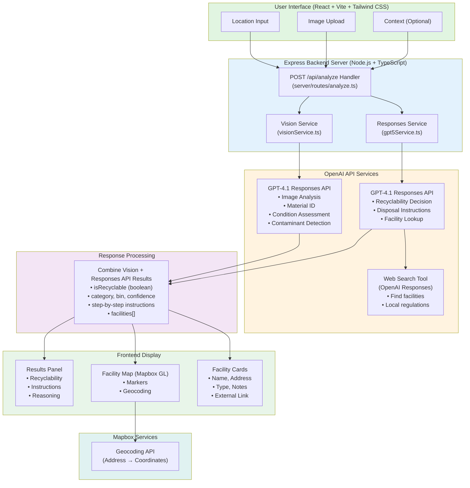

# RecycLens MVP

An AI-powered recycling assistant that helps users identify recyclable items and find nearby recycling facilities.

## Features

- **Image Analysis**: Upload a photo of an item to identify its materials
- **Recyclability Assessment**: Get instant feedback on whether an item can be recycled
- **Local Facilities**: Find nearby recycling and disposal facilities using web search
- **Interactive Map**: View facilities on an interactive Mapbox map with markers
- **Clear Instructions**: Receive step-by-step guidance for proper disposal

## Tech Stack

- **Frontend**: React + TypeScript + Vite + Tailwind CSS
- **Backend**: Node.js + Express + TypeScript
- **AI Services**: OpenAI Responses API (GPT-4.1) for image analysis + OpenAI Responses API (GPT-4.1 with web search) for recyclability
- **Maps**: Mapbox GL JS + React Map GL + Mapbox Geocoding API

## Prerequisites

- Node.js 18+ and npm
- OpenAI API key ([Get one here](https://platform.openai.com/api-keys))
- Mapbox access token ([Get one here](https://account.mapbox.com/access-tokens/)) - Required for map functionality

## Setup

### 1. Install Dependencies

```bash
npm install
```

### 2. Configure Environment Variables

Copy `.env.example` to `.env`:

```bash
cp .env.example .env
```

Edit `.env` and add your API keys:

```
OPENAI_API_KEY=sk-your-actual-api-key-here
VITE_MAPBOX_ACCESS_TOKEN=pk.your-mapbox-token-here
PORT=3001
NODE_ENV=development
```

**Note:** The Mapbox token uses the `VITE_` prefix because Vite requires this for frontend environment variables.

**Note:** The Mapbox access token is required for the interactive map feature. Without it, the map will not display, but other features will still work.

### 3. Run Development Servers

You need to run both the frontend and backend servers:

**Terminal 1 - Backend Server:**
```bash
npm run server
```

The backend will start on `http://localhost:3001`

**Terminal 2 - Frontend Server:**
```bash
npm run dev
```

The frontend will start on `http://localhost:5173` (or another port if 5173 is taken)

### 4. Open in Browser

Navigate to `http://localhost:5173` to use the application.

## Deployment

### Railway Deployment

RecycLens is configured for easy deployment on Railway.

**Quick Steps:**
1. Connect your GitHub repository to Railway
2. Add environment variables:
   - `OPENAI_API_KEY` - Your OpenAI API key
   - `VITE_MAPBOX_ACCESS_TOKEN` - Your Mapbox access token
   - `NODE_ENV=production` - Set to production mode
3. Railway will automatically build and deploy using the `railway.json` configuration

The application will be available at a Railway-provided URL (e.g., `https://your-app.railway.app`).

**Note:** Railway automatically sets the `PORT` environment variable, so you don't need to configure it manually.

## How It Works

### System Architecture & Information Flow



### Process Flow

1. **User Input**: User uploads an image, enters location, and optionally adds context
2. **Image Analysis**: GPT-4.1 Responses API analyzes the image to identify:
   - Primary and secondary materials
   - Item condition (clean, soiled, damaged, etc.)
   - Contaminants (food residue, grease, etc.)
   - Material category
3. **Recyclability Assessment**: GPT-4.1 Responses API receives:
   - Vision analysis results
   - User location
   - Optional user context
   - Uses web search tool to:
     - Determine recyclability based on local regulations
     - Find nearby recycling/disposal facilities
     - Generate step-by-step disposal instructions
4. **Geocoding**: Mapbox Geocoding API converts facility addresses to coordinates
5. **Results Display**: Frontend displays:
   - Recyclability decision with confidence score
   - Disposal instructions
   - Interactive map with facility markers
   - Facility cards with details and links

## API Endpoints

### POST /api/analyze

Analyzes an item for recyclability.

**Request Body:**
```json
{
  "image": "data:image/jpeg;base64,...",
  "location": "Ithaca, NY 14850",
  "context": "Plastic container with food residue"
}
```

**Response:**
```json
{
  "isRecyclable": true,
  "category": "Plastic",
  "bin": "recycling",
  "confidence": 0.87,
  "materialDescription": "Plastic bottle",
  "instructions": [
    "Rinse the container thoroughly",
    "Remove any labels if possible",
    "Place in recycling bin"
  ],
  "reasoning": "This is a clean plastic container that can be recycled.",
  "locationUsed": "Ithaca, NY 14850",
  "facilities": [
    {
      "name": "Green Valley Recycling",
      "type": "Recycling Center",
      "address": "123 Main St, Ithaca, NY",
      "url": "https://example.com",
      "notes": "Accepts plastic containers"
    }
  ]
}
```

## Example cURL Request

```bash
curl -X POST http://localhost:3001/api/analyze \
  -H "Content-Type: application/json" \
  -d '{
    "image": "data:image/jpeg;base64,/9j/4AAQSkZJRg...",
    "location": "Ithaca, NY 14850",
    "context": "Plastic bottle"
  }'
```

## Project Structure

```
RecycLens/
├── server/                 # Backend Express server
│   ├── index.ts           # Server entry point
│   ├── routes/            # API routes
│   │   └── analyze.ts     # Main analysis endpoint
│   ├── services/          # Business logic
│   │   ├── visionService.ts    # Vision API integration
│   │   └── gpt5Service.ts      # Responses API integration
│   └── types.ts           # Backend types
├── src/                    # Frontend React app
│   ├── components/        # React components
│   │   ├── ImageUpload.tsx
│   │   ├── ResultsPanel.tsx
│   │   ├── FacilityCard.tsx
│   │   └── FacilityMap.tsx
│   ├── hooks/             # Custom React hooks
│   │   └── useAnalyzeItem.ts
│   ├── utils/             # Utility functions
│   │   ├── api.ts         # API client
│   │   └── geocoding.ts   # Mapbox geocoding utility
│   └── types/             # TypeScript types
│       └── recycleiq.ts
├── recycleiq-interface.tsx # Main UI component
├── vite.config.ts         # Vite configuration
└── package.json
```

## Troubleshooting

### Backend won't start

- Check that `OPENAI_API_KEY` is set in `.env`
- Ensure port 3001 is not in use
- Check console for error messages

### Frontend can't connect to backend

- Ensure backend server is running on port 3001
- Check Vite proxy configuration in `vite.config.ts`
- Verify CORS is enabled in backend

### API errors

- Verify your OpenAI API key is valid and has credits
- Check that you have access to Responses API (GPT-4.1) for both image analysis and recyclability with web search tool
- Review server logs for detailed error messages
- Ensure your OpenAI account has access to the web search tool

### Image upload issues

- Ensure image is less than 10MB
- Supported formats: JPEG, PNG, GIF, WebP
- Check browser console for errors

### Map not displaying

- Verify `VITE_MAPBOX_ACCESS_TOKEN` is set in `.env` (frontend needs this, note the VITE_ prefix)
- Check browser console for Mapbox-related errors
- Ensure the token has the correct scopes (Geocoding API and Maps API)
- Map will only display when facilities are available
- Restart the dev server after adding the environment variable

## Development Notes

- **Backend Architecture**: Express server serves both API routes and static frontend files in production
- **AI Integration**: 
  - GPT-4.1 Responses API handles image analysis for material identification
  - GPT-4.1 Responses API with `web_search` tool handles recyclability decisions and facility lookup
- **Frontend**: 
  - Development: Vite dev server with proxy to backend
  - Production: Built static files served by Express
- **Maps**: Mapbox GL JS for interactive maps, Mapbox Geocoding API for address-to-coordinates conversion
- **Environment Variables**: 
  - `OPENAI_API_KEY`: Required for both Vision and Responses API
  - `VITE_MAPBOX_ACCESS_TOKEN`: Required for map display (note the `VITE_` prefix for frontend access)
  - `PORT`: Automatically set by Railway in production

## License

© 2025 RecycLens. Making recycling simple.

